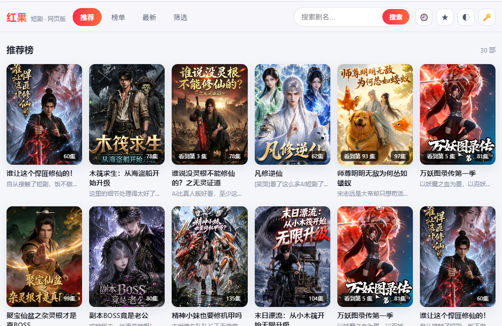

# 红果短剧 · 网页版

## 应用预览

| 主界面 | 播放器 |
|:---:|:---:|
|  |  |

---

## 一、下载发行包

启动前先去 **[Releases 页](https://github.com/sunnysky123/hongguo-web/releases)**
下载与自己系统匹配的那个压缩包，解压就能跑。
**不需要克隆仓库，也不需要预装 Java** —— 每个包都自带对应平台的 Java 运行时。

### 挑哪个包

| 你的系统 | 下载的文件（`1.0.1` 为例） |
|---|---|
| Windows x86-64（绝大多数 PC） | `hongguo-web-1.0.1-Windows-x64.zip` |
| Windows ARM64（骁龙等 ARM 电脑） | `hongguo-web-1.0.1-Windows-arm.zip` |
| Linux x86-64（主流发行版、x86 云服务器） | `hongguo-web-1.0.1-Linux-x64.zip` |
| Linux ARM64（树莓派、ARM 云主机、ARM 发行版） | `hongguo-web-1.0.1-Linux-arm.zip` |
| macOS Apple 芯片（M 系列） | `hongguo-web-1.0.1-macOS-arm.zip` |

> 文件名里的版本号就是 `server/config/config.json` 的 `version` 字段，
> 和包内「平台说明.txt」末尾标的版本一致 —— 两者对得上就说明下对了。
>
> `Windows-arm` 包内置的是同版本的 **x64** JRE：Temurin 没有发布 Windows on ARM
> 的 JRE 25 构建，而 Windows on ARM64 原生兼容 x64 程序，直接用即可。
> 其他四个包都是目标平台的原生运行时。

### 解压并确认结构

用系统自带的解压工具（Windows 下右键「全部解压缩」，
Linux / macOS 下 `unzip hongguo-web-1.0.1-*.zip`）解开后，进入解压出来的目录：

```bash
# Linux / macOS 示例：包内结构直接铺在当前目录
ls
```

应看到 `web/`、`java/`、`server/`、`signer/`、`scripts/`、
`jre/` 以及「平台说明.txt」。

* Windows 资源管理器会多套一层 `hongguo-web-1.0.1-Windows-x64\` 同名文件夹，进不去记得再钻一层。
* 命令行 `unzip` 不会自动套文件夹，包内结构直接铺在当前目录。

包内结构就是完整可运行的程序，后面所有命令都在这个目录里执行。

### 只想跑源码的话（可选）

一般用户用不到。要改代码或自定义构建，才需要克隆仓库：

```bash
git clone https://github.com/sunnysky123/hongguo-web.git
cd hongguo-web
```

仓库本身不含 Java 运行时（否则体积会从 37MB 涨到 200MB 以上），
从源码运行需要本机已有 Java 17+，或自行把 JRE 解压到 `jre/`（启动脚本会自动发现）。

---

## 二、一键启动

### Windows

    scripts\start.bat

双击即可。脚本会检查 Java 运行时、校验签名资产、按需构建 API 服务 JAR，
启动 unidbg 签名服务，等待就绪后拉起 API 服务，并**自动打开浏览器**访问
**<http://127.0.0.1:8000/>**（服务真正就绪后才会打开，不会撞上白屏）。

**端口、监听地址、是否启用签名服务等都在 [`server/config/config.json`](server/config/config.json) 里改，
改完保存即可生效，不用设任何环境变量。** 查看当前实际生效的配置：

    java -jar java\dist\hongguo-api.jar --config

配置项（节选）：

| 配置项 | 默认值 | 说明 |
|---|---|---|
| `api.enabled` | `true` | 是否启动 API 服务。设 `false` 则只跑签名服务、不监听 `api.port` |
| `api.host` | `127.0.0.1` | 监听地址。改成 `0.0.0.0` 可让局域网其他设备访问 |
| `api.port` | `8000` | API 服务端口 |
| `signer.enabled` | `true` | 是否启动签名服务。设 `false` 则只跑免签 API，此时**无法播放** |
| `signer.port` | `9099` | 签名服务端口 |
| `signer.jvm_xmx` | `512m` | 签名服务堆上限 |
| `launcher.open_browser` | `true` | 启动后是否自动开浏览器 |

优先级为 **环境变量 > 配置文件 > 内置默认值**，
所以临时试一下仍可用环境变量覆盖，例如 `PORT=9000 scripts\start.bat`。

**发行包已内置对应平台的 Temurin JRE 25**，`start.bat` 会优先用它。
若提示未找到 Java，说明你在跑源码 checkout：装 Temurin 17+，
或把任意 JRE 17+ 解压到项目的 `jre\` 目录（需含 `bin\java.exe`）再重试。
`install-jre.bat` 已随该改动移除——运行时由打包阶段按平台准备好。

启停就是上面两个配置项，没有额外的命令行开关。四种组合：

| api.enabled | signer.enabled | 结果 |
|---|---|---|
| true | true | 完整模式（默认） |
| true | false | 仅 API，免签接口可用，**无法播放** |
| false | true | 仅签名服务，不监听 `api.port` |
| false | false | 启动即报错退出（没有任何服务在跑） |

临时覆盖用环境变量：`HG_API_ENABLED=0` 或 `HG_SIGN_ENABLED=0`。

其他命令：

    scripts\build-java.bat          手动构建 API 服务 JAR
    scripts\stop.bat                停止全部服务

### Linux / macOS

    scripts/start.sh                # 完整（签名 + API）
    scripts/stop.sh                 # 停止

### 免脚本手动方式

    java -jar java/dist/hongguo-api.jar                # 完整（自动拉起签名服务）
    java -jar java/dist/hongguo-api.jar --config       # 查看生效配置
    java -jar java/dist/hongguo-api.jar --selftest     # 跑自检

JAR 不存在时先构建：`bash scripts/build-java.sh`（或 Windows 下双击 `build-java.bat`）。

---

## 环境要求

| 组件 | 版本 | 是否必需 |
|---|---|---|
| Java | **>= 25**（发行包自带 `jre` Temurin 25 LTS） | 必需 |
| ffmpeg | 任意近期版本 | 可选，剥离 CENC 信令让浏览器可直接播 |

**clone 或发行包均可直接运行**：仓库已含构建好的 `java/dist/hongguo-api.jar`，
目标机只需要 Java 运行时（JRE），**不需要 JDK，不需要编译**。
JDK 仅在修改源码后重新构建时才需要（17+ 即可编译，用 25 编译则与发行包一致）——
构建只用 JDK 自带的 `javac` 与 `jar`，无任何第三方依赖、不用联网拉包。

> **Java 低于 25 怎么办**：`java/dist/hongguo-api.jar` 用 JDK 25 编译
> （class 版本 69），低版本运行会报 `UnsupportedClassVersionError`。
> 要么直接用发行包自带的 `jre/`（Temurin 25 LTS），要么用你本地的 JDK（17+）
> 重新跑一次 `bash scripts/build-java.sh` / `scripts\build-java.bat`，
> 产物即适配你的版本（纯 javac，不联网）。

---

## 前端功能

- 推荐 / 榜单 / 最新 / 筛选四个 tab，**回车或点按钮**触发搜索
- 弹层播放器：横屏 16:9 固定占位，加载前后不跳动；HEVC 直出不转码
- 集数按钮 + 一行五列的选集卡片
- 简介悬浮气泡（默认隐藏，不占位不抖动）
- **播放历史**：自动记录播过的剧与集数，「继续播放」从对应集数接着看
- **打开即续播**：从推荐/搜索点开看过的剧，自动跳到上次看到的那一集；
  卡片封面左下角标出「看到第 N 集」
- **收藏**：播放器内一键收藏，列表可续播；数据存浏览器 `localStorage`（各 200 条上限）
- **密钥自动获取**：首次启动自动取密钥，取不到时按 1s→2s→4s 退避重试并显示
  「获取中」状态行；拿到后卡片自动关闭。服务重启换密钥（401）也会自动换新并恢复加载
- 自动连播与下一集后台预热、暗色/浅色主题

历史与收藏的完整说明见 [使用说明.md](使用说明.md) 第 3.4 节。

---

## 自检

    java -jar java/dist/hongguo-api.jar --selftest

预期输出 `结果：114/114 全部通过`。不联网、不依赖签名服务，可在离线环境运行。

覆盖 spade 解包 5 组真值、CTR 计数器构造、逐样本 IV、AVCC 自证、
MP4 盒解析、端到端解密还原、JSON 语义、缓存路径、设备身份、剧集解析、
流式解密一致性、缓存上限与过期清扫、搜索分页切片等
18 组共 114 项断言 —— 这些都是踩坑后固化的回归基线，用于判断迁移是否等价。

---

## 文档

| 文档 | 内容 |
|---|---|
| `使用说明.md` | 环境配置、全部接口、环境变量、常见问题 |
| `签名服务说明.md` | **签名服务集成细节**：目录约束、JRE、协议、排查 |

---

## 目录结构

```
hongguo-web/
├── scripts/
│   ├── start.bat / start.sh      一键启动（签名 + API）
│   ├── stop.bat / stop.sh        停止全部服务
│   ├── build-java.bat / .sh      构建 API 服务 JAR（纯 javac，无需联网）
│   └── pack.sh                   打包 5 个平台发行版（内置 JRE）
├── java/
│   ├── src/com/hongguo/api/      Java 后端源码（19 个文件，零第三方依赖）
│   │   ├── Main.java             入口
│   │   ├── Launcher.java         进程编排（拉起签名服务并等就绪）
│   │   ├── Server.java           HTTP 路由
│   │   ├── SelfTest.java         自检套件
│   │   ├── core/                 Spade / Mp4 / Device / KeyStore / Safeguards
│   │   ├── service/              Signer / Client / Stream / Res
│   │   └── util/                 Json / Crypto / Http / Log
│   └── dist/hongguo-api.jar      API 服务 JAR（已入库，clone 后可直接运行）
│   └── build/                    编译中间产物
├── signer/
│   ├── runner/
│   │   └── unidbg-sign.jar   unidbg 签名服务（跨平台 fat JAR，未改动）
│   └── capture/
│       └── fq_oversea/       签名算法依赖的 so（路径不可改）
├── jre/                          Java 运行时（仅发行包内有；仓库不含）
├── server/
│   ├── config/config.json        启动配置（端口、监听地址、签名开关、调优参数）
│   ├── config/content-config.json  上游配置与 base_query
│   └── data/                       运行时数据（密钥、设备标识、解密缓存）
└── web/                          前端静态资源
```

---

## 致谢

本项目的逆向分析思路与部分实现，参考自以下开源项目：

- **[hongguo-desktop-releases](https://github.com/waligoraamodio288-rgb/hongguo-desktop-releases)** —— 桌面端版本，提供了本项目最初的分析起点与对照实现，感谢原作者的分享。

---

## 注意事项

- 签名服务默认只监听 `127.0.0.1`；若把 API 改为对外暴露，
  **必须**设置 `ADMIN_TOKEN`。
- 签名服务无鉴权，勿直接暴露到公网。
- 不要随意删除 `server/data/device.json`：重新生成设备标识可能触发上游风控。
- **控制台只输出 `hongguo-api.jar` 的运行信息**；启动器自身的检查与排障信息
  写入 `server/data/log/start.log`（每次启动覆盖），排查启动问题先看该文件。
- 本项目仅供技术研究与学习，请勿用于批量抓取或传播受版权保护的内容。
